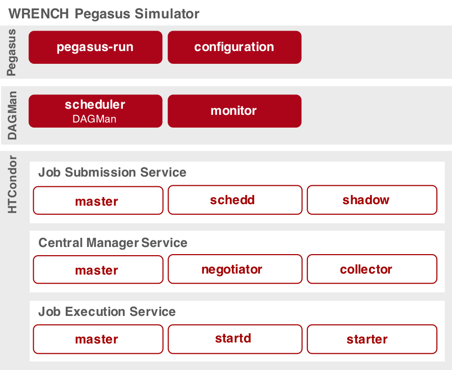

[![Build Status][travis-badge]][travis-link]
[![GitHub Release][release-badge]][release-link]
[![License: LGPL v3][license-badge]](LICENSE)
[![CodeFactor][codefactor-badge]][codefactor-link]

# WRENCH-Pegasus Implementation


This project is a [WRENCH](http://wrench-project.org)-based simulator of the [Pegasus](https://pegasus.isi.edu) WMS. 
Since Pegasus relies on HTCondor, first we have implemented the HTCondor services as 
simulated core CI services, which together form a new Compute Service that exposes the 
WRENCH Developer API. This makes HTCondor available to any WMS implementation that is 
to be simulated using WRENCH.

HTCondor is composed of six main service daemons (startd, starter, schedd, shadow, 
negotiator, and collector). In addition, each host on which one or more of these 
daemons is spawned must also run a master daemon, which controls the execution of 
all other daemons (including initialization and completion). The bottom part of 
the simulator architecture figure below depicts the components of our simulated 
HTCondor implementation, where daemons are shown in red-bordered boxes. In our simulator 
we implement the 3 fundamental HTCondor services, implemented as particular sets 
of daemons, as depicted in the bottom part of the figure shown below in borderless 
white boxes. The Job Execution Service consists of a startd daemon, which adds the 
host on which it is running to the HTCondor pool, and of a starter daemon, which 
manages task executions on this host. The Central Manager Service consists of a 
collector daemon, which collects information about all other daemons, and of a 
negotiator daemon, which performs task/resource matchmaking. The Job Submission 
Service consists of a schedd daemon, which maintains a queue of tasks, and of 
several instances of a shadow daemon, each of which corresponds to a task submitted 
to the Condor pool for execution.

We implemented the simulated Pegasus WMS, including the DAGMan workflow engine, 
using the WRENCH Developer API. This implementation instantiates all services and 
parses the workflow description file, the platform description file, and a 
Pegasus-specific configuration file. DAGMan orchestrates the workflow execution, 
and monitors the status of tasks submitted to the HTCondor pool using a pull model.
The top part of the architecture figure below depicts the components of our 
simulated Pegasus implementation (each shown in a red box).




**WRENCH Research Paper:**
- H. Casanova, R. Ferreira da Silva, R. Tanaka, S. Pandey, G. Jethwani, W. Koch, S.
  Albrecht, J. Oeth, and F. Suter, [Developing Accurate and Scalable Simulators of
  Production Workflow Management Systems with 
  WRENCH](https://rafaelsilva.com/files/publications/casanova2020fgcs.pdf), 
  Future Generation Computer Systems, 2020. 

## Prerequisites

WRENCH-Pegasus is fully developed in C++. The code follows the C++11 standard, and thus older 
compilers tend to fail the compilation process. Therefore, we strongly recommend
users to satisfy the following requirements:

- **CMake** - version 3.2.3 or higher
  
And, one of the following:
- **g++** - version 5.0 or higher
- **clang** - version 3.6 or higher

## Dependencies

- [WRENCH](http://wrench-project.org/) - [version 1.6](https://github.com/wrench-project/wrench)

## Building From Source

If all dependencies are installed, compiling and installing WRENCH-Pegasus is as simple as running:

```bash
cmake .
make
make install  # try "sudo make install" if you do not have the permission to write
```

## Get in Touch

The main channel to reach the WRENCH-Pegasus team is via the support email: 
[support@wrench-project.org](mailto:support@wrench-project.org).

**Bug Report / Feature Request:** our preferred channel to report a bug or request a feature is via  
WRENCH-Pegasus' [Github Issues Track](https://github.com/wrench-project/pegasus/issues).


[travis-badge]:       https://travis-ci.org/wrench-project/pegasus.svg?branch=master
[travis-link]:        https://travis-ci.org/wrench-project/pegasus
[license-badge]:      https://img.shields.io/badge/License-LGPL%20v3-blue.svg
[release-badge]:      https://img.shields.io/github/release/wrench-project/pegasus/all.svg
[release-link]:       https://github.com/wrench-project/pegasus/releases
[codefactor-badge]:   https://www.codefactor.io/repository/github/wrench-project/pegasus/badge
[codefactor-link]:    https://www.codefactor.io/repository/github/wrench-project/pegasus
